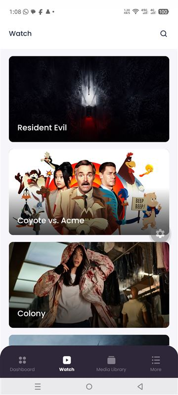
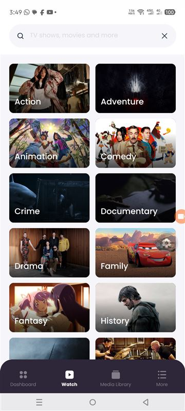
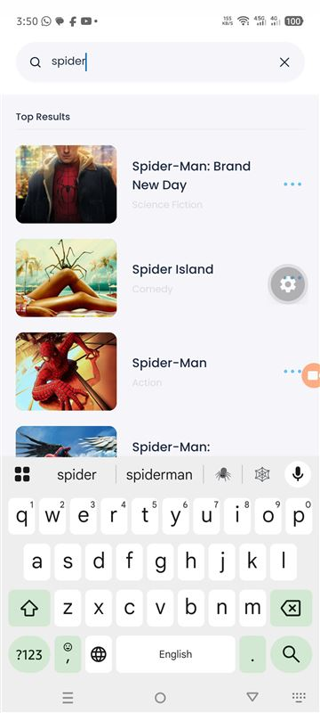
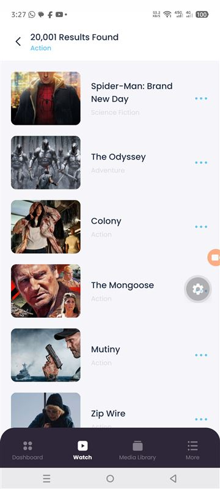
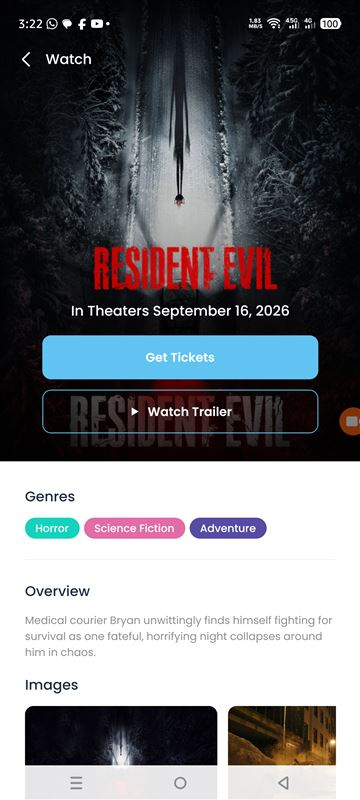
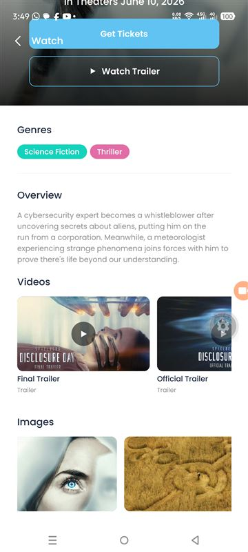
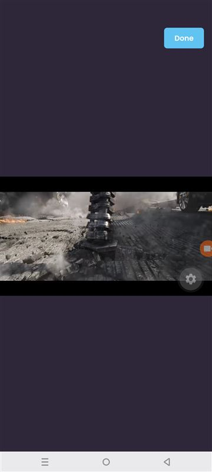
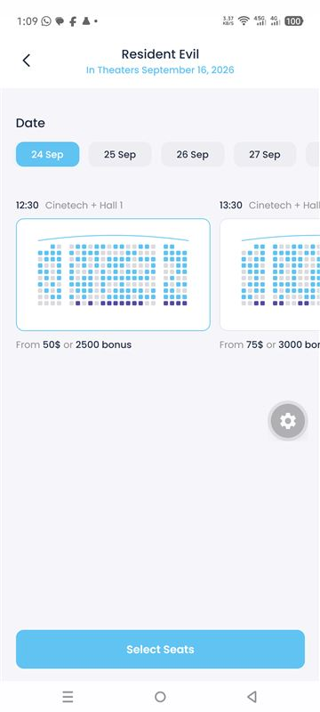
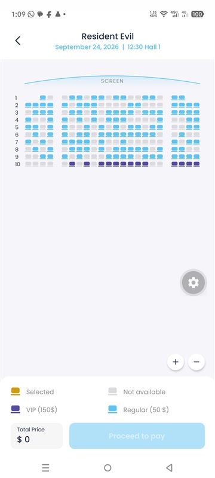

# TenTwenty – Movie Tickets

An app that lists **upcoming movies from The Movie Database (TMDB)**. You can open any movie, watch its trailer full screen, search by title or genre, and book tickets on an interactive seat map.

**Stack:** React Native 0.86 · TypeScript (strict) · Expo SDK 57 · Zustand · TanStack Query · FlashList · React Navigation 7

- **Architecture:** clean architecture (domain, data and presentation layers).
- **Offline:** works offline; loaded data stays on the device.
- **Orientation:** supports portrait and landscape.
- **Testing:** tested on a real Android 15 device.

---

## Contents

1. [Screenshots](#1-screenshots)
2. [Requirements checklist](#2-requirements-checklist)
3. [How to run it](#3-how-to-run-it)
4. [Tech stack](#4-tech-stack)
5. [Architecture](#5-architecture)
6. [Screens and features](#6-screens-and-features)
7. [Offline and persistence](#7-offline-and-persistence)
8. [Performance and APK size](#8-performance-and-apk-size)
9. [Portrait and landscape](#9-portrait-and-landscape)
10. [Code quality and tests](#10-code-quality-and-tests)
11. [Engineering notes](#11-engineering-notes)
12. [About the SDK versions in the brief](#12-about-the-sdk-versions-in-the-brief)
13. [Known limitations](#13-known-limitations)

---

## 1. Screenshots

All screenshots were taken on a real device (Infinix X6886, Android 15).

| Watch (upcoming) | Search: genres | Search: typing | Results |
|:---:|:---:|:---:|:---:|
|  |  |  |  |

| Movie detail | Detail: videos and images | Trailer (autoplay) | Ticket booking | Seat selection |
|:---:|:---:|:---:|:---:|:---:|
|  |  |  |  |  |

> Some screenshots were taken in Expo Go, whose floating ⚙️ developer button shows on the right edge. The button doesn't appear in the APK.

---

## 2. Requirements checklist

### Assignment features

| # | Requirement | Status | Where to look |
|---|---|:---:|---|
| 1 | **Movie List screen** listing all upcoming movies from `/3/movie/upcoming` with `api_key` | ✅ | [`WatchListScreen.tsx`](src/presentation/features/movies/screens/WatchListScreen.tsx) loads every page with infinite scroll. [`httpClient.ts`](src/core/network/httpClient.ts) adds `api_key`. |
| 2 | **Movie Detail screen** opened from the list | ✅ | [`MovieDetailScreen.tsx`](src/presentation/features/movies/screens/MovieDetailScreen.tsx) |
| 3 | Uses the **Movie Details API** `/3/movie/<id>` | ✅ | Title, release date, genres, overview |
| 4 | Uses the **Get Images API** `/3/movie/<id>/images` | ✅ | Title logo on the poster, plus an image gallery |
| 5 | **Watch Trailer** gets its video from `movie/<id>/videos` | ✅ | [`selectTrailer.ts`](src/domain/usecases/selectTrailer.ts) picks the best video: official trailer, then teaser, then clip |
| 6 | Trailer plays in a **full-screen player that starts automatically** | ✅ | [`TrailerPlayerScreen.tsx`](src/presentation/features/movies/screens/TrailerPlayerScreen.tsx) |
| 7 | Player **closes by itself when the trailer ends** and returns to the detail page | ✅ | The player reports "ended", and the screen goes back |
| 8 | **Done** button cancels playback | ✅ | Top-right of the player |
| 9 | **Movie search screen** | ✅ | [`SearchScreen.tsx`](src/presentation/features/search/screens/SearchScreen.tsx) (genre grid, live results as you type) and [`SearchResultsScreen.tsx`](src/presentation/features/search/screens/SearchResultsScreen.tsx) |
| 10 | **Seat mapping (UI only)** | ✅ | [`TicketBookingScreen.tsx`](src/presentation/features/booking/screens/TicketBookingScreen.tsx) and [`SeatSelectionScreen.tsx`](src/presentation/features/booking/screens/SeatSelectionScreen.tsx) |
| 11 | Matches the **Figma design** (7 screens, Poppins font, colour palette) | ✅ | [`src/core/theme`](src/core/theme) holds the palette and type scale taken from the Figma guide |

### General requirements

| Requirement | Status | How it is met |
|---|:---:|---|
| React Native application | ✅ | React Native 0.86 + TypeScript (strict), using Expo SDK 57 |
| Supports **landscape and portrait** | ✅ | Every screen adapts to the orientation. See [section 9](#9-portrait-and-landscape). |
| Buildable app that **runs on an Android device** | ✅ | Release APKs built and tested on an Android 15 phone. See [section 3](#3-how-to-run-it). |
| Runs on an **iOS device** | ✅ Code / ⚠️ untested | The same code base and Expo config support iOS. Building it needs a Mac with Xcode, or EAS Build. It was developed on Windows, so no iOS build has been tested yet. |
| **Min SDK 19 / target SDK 28 / iOS 10+** | ⚠️ See [section 12](#12-about-the-sdk-versions-in-the-brief) | No current React Native release can meet these. The app uses **min SDK 24 / target SDK 36 / iOS 15.1**. |
| Follows **React Native coding standards** | ✅ | Strict TypeScript, `expo lint` (ESLint 9, including React Compiler rules) with no warnings, Prettier |
| Uses a **clean architecture pattern** | ✅ | Domain, data and presentation layers, wired together in one composition root. See [section 5](#5-architecture). |
| **Highly efficient** | ✅ | FlashList, memoized rows, images sized to the screen, R8 shrinking, one APK per CPU type. See [section 8](#8-performance-and-apk-size). |
| **Persists data and works offline** | ✅ | Data saved on the device for 7 days, image disk cache, saved bookings. See [section 7](#7-offline-and-persistence). |
| 3rd-party libraries | ✅ | See [section 4](#4-tech-stack) |
| Offline first (optional) | ✅ | TanStack Query `networkMode: 'offlineFirst'` plus a persisted cache |

---

## 3. How to run it

### Option A: install the APK (fastest, no setup)

The APKs are shared alongside this submission. They are not committed to the repository.

| File | Use on |
|---|---|
| `TenTwenty-v1.0.0-arm64.apk` (~30 MB) | **Nearly every Android phone from the last ~6 years.** Use this one. |
| `TenTwenty-v1.0.0-armv7.apk` (~24 MB) | Older 32-bit phones only |

1. Copy the APK to the phone (USB, Google Drive, WhatsApp and so on) and tap it.
2. If Android asks, allow **"Install unknown apps"** for the app you opened it with.
3. Open **TenTwenty**. The TMDB key is already built in, so no setup is needed.

With USB debugging on, you can also install from a computer: `adb install TenTwenty-v1.0.0-arm64.apk`

### Option B: run from source in Expo Go (live reload)

**Prerequisites:** Node.js **20.19+**, and the **Expo Go** app (SDK 57) on your phone.

```bash
git clone <repo-url> && cd tentwenty-app-test
npm install

# TMDB API key (free: https://www.themoviedb.org/settings/api)
cp .env.example .env
# then edit .env:
#   EXPO_PUBLIC_TMDB_API_KEY=<your 32-character API key>

npm run start:reset
```

Scan the QR code with **Expo Go** on Android, or with the **Camera** app on iOS. The phone and the computer must be on the same Wi-Fi network. If they can't connect, use `npx expo start --tunnel`.

> - The app accepts either TMDB credential. The short v3 **API Key** is sent as `?api_key=` (as the brief specifies). The long v4 **Read Access Token** (`eyJ…`) is sent as a `Bearer` header.
> - Without a key, every screen shows a clear "API key missing" message instead of crashing.
> - After you change `.env`, restart Metro with `npm run start:reset`.

Every native module the app uses is included in Expo Go, so no custom development build is needed.

### Option C: build it natively

**Android** (needs the Android SDK and JDK 17 or 21; Android Studio's bundled JDK works):

```bash
npx expo prebuild --platform android      # generates ./android from app.json
cd android

# Release APK for modern phones (arm64):
./gradlew assembleRelease -PreactNativeArchitectures=arm64-v8a
# Output: android/app/build/outputs/apk/release/app-release.apk

# Google Play bundle (Play serves each device only what it needs):
./gradlew bundleRelease
```

Stop any running Metro/Expo dev server before building a release. Both use the same Metro cache folder, and the release build fails on Windows while the dev server holds it.

**iOS** (needs macOS and Xcode):

```bash
npx expo prebuild --platform ios
npx expo run:ios            # simulator or a connected device
```

**Cloud builds (no local SDKs):** `eas.json` is included. After `npm i -g eas-cli` and `eas login`, run `eas build -p android --profile preview` for an APK, or `eas build -p ios`. For cloud builds, set the key with `eas env:create --name EXPO_PUBLIC_TMDB_API_KEY --value <key>`, because `.env` is not uploaded.

### Useful scripts

| Command | What it does |
|---|---|
| `npm start` | Start Metro for Expo Go |
| `npm run start:reset` | Same, but clears the Metro cache (use after editing `.env`) |
| `npm run android` / `npm run ios` | Build and run the native app on a device or simulator |
| `npm run validate` | **Type check, lint and tests in one go** |
| `npm run typecheck` | `tsc --noEmit` (strict mode) |
| `npm run lint` | `expo lint` (ESLint 9 + eslint-config-expo) |
| `npm test` | Jest unit tests (`jest-expo` preset) |
| `npm run format` | Prettier |

---

## 4. Tech stack

| Area | Library (version) | Why it was chosen |
|---|---|---|
| Framework | **React Native 0.86**, **Expo SDK 57**, React 19.2 | Current stable release with the New Architecture and Hermes. Expo gives one-command setup and testing in Expo Go. |
| Language | **TypeScript 6** (`strict`, `noUnused*`) | Types from the API response to the UI; many errors are caught at compile time |
| Navigation | **@react-navigation 7**: native-stack and bottom-tabs | Native screen transitions. Routes are fully typed through a global `RootParamList`. |
| Server state | **@tanstack/react-query 5** + `react-query-persist-client` | Caching, pagination (`useInfiniteQuery`), retries, request de-duplication, cancellation, and a cache saved to disk for offline use |
| Client state | **Zustand 5** (+ `persist` middleware) | Small, fast, with no boilerplate. Selectors limit re-renders. Used for bookings and network status. |
| Storage | **expo-sqlite/kv-store** | A *synchronous* key-value store, so saved state is ready on the first render with no loading flash. Included in Expo Go. |
| HTTP | **axios 1** | Interceptors add the API key in one place and turn every error into a typed `ApiError` |
| Lists | **@shopify/flash-list 2** | Reuses cells instead of creating new ones, for long paginated lists and grids |
| Images | **expo-image** | Memory and disk cache (Glide on Android, SDWebImage on iOS), so posters already seen still show offline |
| Connectivity | **@react-native-community/netinfo** | Drives the offline banner and pauses and resumes network requests |
| Trailer | **react-native-webview** + our own YouTube IFrame page | Autoplays and reliably reports when the video ends. See [section 11](#11-engineering-notes). |
| UI | **expo-linear-gradient**, **react-native-svg**, **expo-font** (Poppins), expo-splash-screen | Gradients and icons from the Figma design; the splash screen stays up until the fonts load |
| Orientation | **expo-screen-orientation** + `"orientation": "default"` | Portrait and landscape, including inside Expo Go |
| Build | **expo-build-properties** | Turns on R8 code shrinking and resource shrinking through config, so it survives `expo prebuild` |
| Testing and quality | **Jest 29** + jest-expo, **ESLint 9** + eslint-config-expo, **Prettier 3** | Unit tests, linting (including React Compiler rules) and formatting |

---

## 5. Architecture

The app follows **clean architecture**, and dependencies only point inward:

```
  ┌──────────────────────────── presentation ────────────────────────────┐
  │  screens · components · navigation · Zustand stores · query hooks    │
  └──────────────┬───────────────────────────────────────────────────────┘
                 │ depends on the interface only
  ┌──────────────▼──────────── domain (pure TypeScript) ─────────────────┐
  │  entities (Movie, Video, Booking…) · MovieRepository interface ·     │
  │  use cases (selectTrailer, playableVideos, dedupeMovies)             │
  └──────────────▲───────────────────────────────────────────────────────┘
                 │ implements the interface
  ┌──────────────┴──────────────── data ─────────────────────────────────┐
  │  TmdbRemoteDataSource (HTTP) → DTOs → mappers → TmdbMovieRepository  │
  └──────────────────────────────────────────────────────────────────────┘
  app/di.ts is the one place that connects TmdbMovieRepository to the interface.
```

- **The domain layer has no React and no axios.** It holds the business rules, for example which video counts as "the trailer" and how duplicate movies are removed. These are unit tested in isolation.
- **Data layer:** DTOs mirror TMDB's JSON (`snake_case`), and mappers turn them into clean entities (`camelCase`, empty strings become `null`, unused fields are dropped).
- **Presentation layer:** screens call hooks such as `useUpcomingMovies()`, which call the `MovieRepository` **interface**. Screens never know TMDB exists. Replacing TMDB with a mock or another backend only means changing [`di.ts`](src/app/di.ts).
- **Path aliases** (`@core`, `@domain`, `@data`, `@presentation`, `@app`, `@assets`) are configured in `babel.config.js` for Metro and Jest, and in `tsconfig.json` for the type checker.

**How a request flows:**
`WatchListScreen` → `useUpcomingMovies()` (TanStack Query) → `movieRepository.getUpcomingMovies(page)` → `TmdbRemoteDataSource.getUpcoming()` (axios adds `api_key`) → DTO → `mapMovie` → `Movie[]` → cached in memory and on disk → rendered by FlashList.

### Folder structure

```
src/
├── app/                        # Composition root
│   ├── App.tsx                 # Fonts + splash → ErrorBoundary → Providers → Navigation + OfflineBanner
│   ├── AppProviders.tsx        # SafeArea, persisted QueryClient, NetInfo → Zustand bridge
│   └── di.ts                   # Binds MovieRepository → TmdbMovieRepository
├── core/                       # Framework-level code, not tied to any feature
│   ├── config/                 # env (EXPO_PUBLIC_*), constants (cache age, timeouts)
│   ├── network/                # axios client, typed ApiError
│   ├── query/                  # QueryClient, disk persister, online/focus managers
│   ├── storage/                # Synchronous kv-store + Zustand storage adapter
│   ├── hooks/                  # useResponsive, useDebouncedValue, useKeyboardVisible
│   ├── theme/                  # Colours, typography (Poppins), spacing, from the Figma guide
│   └── utils/                  # Dates, image-size tiers, YouTube thumbnails
├── domain/                     # Pure TypeScript
│   ├── entities/               # Movie, MovieDetail, MovieImages, Video, Booking, Seat
│   ├── repositories/           # MovieRepository (the contract)
│   └── usecases/               # selectTrailer, playableVideos, dedupeMovies
├── data/                       # Implements the domain contracts
│   ├── dto/                    # Raw TMDB response types
│   ├── mappers/                # DTO → entity
│   ├── datasources/            # TmdbRemoteDataSource (HTTP only)
│   └── repositories/           # TmdbMovieRepository
└── presentation/
    ├── navigation/             # Root stack, bottom tabs, Watch stack, custom tab bar, typed params
    ├── components/             # AppText, Skeleton (shimmer), RemoteImage, SearchBar, OfflineBanner, StateViews…
    ├── hooks/                  # React Query hooks, query keys, useAfterTransition, queryStatus
    ├── stores/                 # Zustand: useBookingStore (persisted), useNetworkStore
    └── features/
        ├── movies/             # Watch list, detail, trailer player, cards, video thumbnails
        ├── search/             # Search, results, genre tiles, result rows
        ├── booking/            # Ticket booking, seat selection, seat-layout generator
        └── more/               # My Tickets, placeholder tabs
__tests__/                      # Unit tests (core, domain, data, booking)
docs/screenshots/               # Screenshots from the real device
```

---

## 6. Screens and features

| Figma | Screen | APIs | What it does |
|---|---|---|---|
| 01 | **Watch** | `/movie/upcoming?page=n` | Upcoming movies with infinite scroll (`useInfiniteQuery`, next page from `page`/`total_pages`), pull to refresh, and shimmer skeletons. Details start loading as soon as you touch a card. |
| 02 | **Search: idle** | `/genre/movie/list` | Genre grid. Tile images reuse backdrops of movies already in the cache, so it makes no extra requests. |
| 03 | **Search: typing** | `/search/movie` | Live "Top Results", waiting 400 ms after you stop typing. Earlier requests are cancelled, and the previous results stay visible to avoid flicker. |
| 04 | **Results found** | `/search/movie`, `/discover/movie` | "N Results Found" for a submitted search or a tapped genre, with infinite scroll |
| 05 | **Movie detail** | `/movie/{id}`, `/movie/{id}/images`, `/movie/{id}/videos` | Poster, logo, release date, colour-coded genre chips, overview, a **Videos** row (static YouTube thumbnails) and an **Images** gallery |
| — | **Trailer player** | YouTube IFrame API | Full screen, **autoplays**, **closes by itself when the video ends**, and **Done** closes it early. It fits 16:9 in both orientations. |
| 06 | **Ticket booking** | — (UI only) | Next 7 dates, showtime cards with an SVG seat-map preview, and a "Select Seats" button |
| 07 | **Seat selection** | — (UI only) | Interactive seat map (regular, VIP, unavailable, selected), zoom in/out, legend, selected-seat chips, live total and **Proceed to pay**. The booking is saved on the device. |
| + | **More → My Tickets** | — | Confirmed bookings, saved on the device and available offline. Bookings can be cancelled. |

**Loading, empty and error states**, used across the whole app:

- **Shimmer skeletons** on every screen that loads data. One shared animation drives all of them, using the native driver.
- **Loading more:** skeleton rows at the bottom of a list, instead of a spinner.
- **Error:** a friendly message with a **Try again** button. TMDB errors such as "invalid key", "not found" or "server" are mapped to readable text.
- **Offline, with nothing saved yet:** a clear "You're offline" screen. The content loads by itself when the connection returns.

---

## 7. Offline and persistence

| What | How | How long |
|---|---|---|
| Movie lists, details, images, genres | TanStack Query cache saved to the device (`PersistQueryClientProvider` + sync persister) | 7 days |
| Posters and backdrops | expo-image memory and disk cache | Managed by the OS |
| Bookings (My Tickets) | Zustand `persist` → expo-sqlite kv-store | Until the user cancels them |
| Live search results | In memory only. They are only useful while online, so they aren't written to disk. | The session |

**What the user sees offline:**

1. A dark banner slides down: **"You are offline · showing saved content"** (screen readers announce it too).
2. Screens seen before show their saved content right away, even after the app is closed and reopened.
3. Screens never opened before show a **"You're offline"** screen instead of a loading skeleton that never finishes.
4. The trailer button says **"Trailer Needs Internet"**, and the player shows a message instead of a broken video.
5. When the connection returns, the banner turns green (**"Back online"**) and paused screens load by themselves.

The cache has a version number (`QUERY_CACHE.BUSTER`). When the data format changes, old saved data is discarded cleanly instead of being read in the wrong shape.

---

## 8. Performance and APK size

### Rendering

- **FlashList everywhere a list can grow.** Cells are reused instead of recreated. Grid gaps come from cell padding, so no extra wrapper views are needed.
- The **4 fixed showtime cards** use a plain `ScrollView`: virtualizing 4 items would only add overhead.
- **Memoized rows** (`React.memo`) with stable callbacks. Selecting a seat re-renders **only that seat**, not all ~250.
- **Heavy screens mount after their slide-in finishes.** The seat map shows a skeleton during the transition, so the animation stays smooth.
- The showtime seat previews are drawn as **one SVG each**, instead of ~250 views.
- **Videos are static thumbnails.** The player (a WebView) is only created when the user taps one.

### Network and memory

- **Image sizes match the screen:** they start at `w342` and only step up (`w500`, `w780`, `w1280`) when the on-screen size needs it. Search thumbnails use `w342`, genre tiles `w500`, full-width cards `w780`. `recyclingKey` stops reused cells from briefly showing the wrong image.
- **Trimmed data:** TMDB can return 100+ images per movie. The data layer keeps **one logo and 12 backdrops**, not the posters, which the app never shows.
- **Requests:** search waits 400 ms after typing stops, earlier requests are cancelled with `AbortSignal`, and detail data is prefetched on touch.
- **TMDB pagination:** the same movie sometimes appears on two pages, so duplicates are removed and list keys stay unique.

### APK size

| Build | Size |
|---|---|
| First build: one universal APK for all CPU types, no shrinking | 76 MB |
| **arm64 APK, R8 + resource shrinking** | **30.5 MB** |
| armv7 APK (older phones) | 23.8 MB |

- **Splitting by CPU type** (arm64 / armv7) means each phone downloads only the native code it uses.
- **R8 code shrinking** cut the compiled code from 23.7 MB to 8.4 MB.
- **Resource shrinking** removes unused resources. Both are configured in `app.json` (`expo-build-properties`).
- For Google Play, `bundleRelease` produces an `.aab`, and Play then serves each device only what it needs.

---

## 9. Portrait and landscape

`useResponsive()` (built on `useWindowDimensions`) drives every layout, so rotating the device re-lays out the screen immediately:

| Screen | Portrait | Landscape / tablet |
|---|---|---|
| Watch | 1 column | 2–3 columns |
| Search genres | 2 columns | Up to 4 columns |
| Search results | 1 column | 2 columns |
| Movie detail | Poster above the content | Poster on the left, scrolling content on the right |
| Seat selection | Checkout panel below the map | Checkout panel on the right |
| Trailer | Largest 16:9 area that fits | Largest 16:9 area that fits |

The bottom tab bar switches to a compact icon-and-label row in landscape. Safe-area insets are handled on every edge, including notches in landscape.

---

## 10. Code quality and tests

```bash
npm run validate      # type check + lint + tests
```

- **TypeScript strict mode**, including `noUnusedLocals` and `noUnusedParameters`, with no `any` in app code.
- **`expo lint`** (ESLint 9 + eslint-config-expo, including the **React Compiler rules**) passes with no warnings.
- **Prettier** formatting.
- **27 unit tests in 9 suites:**

| Suite | What it covers |
|---|---|
| `domain/selectTrailer` | Trailer priority (official trailer, then teaser, then clip) and YouTube-only |
| `domain/playableVideos` | Filtering, ordering, and not changing the input |
| `domain/dedupeMovies` | Removing duplicates across pages, keeping order |
| `domain/youtubePlayerHtml` | Autoplay settings, and **rejecting anything that isn't a YouTube ID** (no script injection) |
| `data/movieMapper` | DTO → entity mapping, `null` handling, pagination, image trimming |
| `core/image` | Picking the image size tier and building thumbnail URLs |
| `core/date` | Parsing dates in local time (no UTC off-by-one), design date formats, month rollover |
| `core/queryStatus` | Telling "offline and waiting" apart from "loading" |
| `booking/seatLayout` | The same seat layout every time for a showtime, row width, VIP row, unique IDs |

- **Accessibility:** roles, labels, hints and states on interactive elements, and touch targets of at least 44 pt. `maxFontSizeMultiplier` stops very large system fonts from breaking layouts. Connectivity changes are announced to screen readers.
- **Resilience:**
  - A global `ErrorBoundary` catches crashes.
  - A typed `ApiError` gives readable messages.
  - Requests are only retried for errors that can be retried (network, timeout, server).

---

## 11. Engineering notes

**The trailer player.** The first version used `react-native-youtube-iframe`. On Android it never autoplayed, for two reasons:

1. `react-native-webview` delivers messages to `document`, but the player page listened on `window`, so play and mute commands never arrived.
2. The library's default hosted player page expects plain-text commands, while the installed version sends JSON.

The library was replaced with a small, tested player page ([`youtubePlayerHtml.ts`](src/presentation/features/movies/components/youtubePlayerHtml.ts)). The page starts **muted autoplay itself**, which Android allows without a tap, unmutes once playback begins, and only sends events *back* to the app (ready, state, error). Nothing has to be sent into the WebView, so neither problem can happen. The video ID is checked against YouTube's ID format before it goes into the HTML.

**Synchronous storage.** `expo-sqlite/kv-store` has a synchronous API, so saved Zustand state and the saved query cache are available on the very first render. The app never flashes empty and then fills in.

**Offline-aware loading states.** With `networkMode: 'offlineFirst'`, a request with nothing cached is *paused* while offline instead of failing, which would otherwise show a loading skeleton forever. [`isWaitingForNetwork`](src/presentation/hooks/queryStatus.ts) detects this so the screen can show the offline message instead.

**Seat map (UI only).** Seat availability comes from a seeded random generator keyed on movie + date + showtime. Each showtime always shows the same taken seats, without needing a backend.

---

## 12. About the SDK versions in the brief

The brief asks for **Android min SDK 19 / target SDK 28** and **iOS 10+**. The app uses **min SDK 24 / target SDK 36** and **iOS 15.1**, on purpose:

- **No maintained React Native release supports Android 19 or iOS 10.** React Native dropped API 19 in version 0.64 (2021). Today's minimums are **API 24** and **iOS 15.1**. Meeting the brief would mean a ~5-year-old React Native release, which the current Expo, Zustand 5, TanStack Query 5, FlashList 2 and the New Architecture don't support.
- **Min SDK 24 still covers about 99% of Android devices in use.**
- **Google Play no longer accepts apps that target SDK 28**, and Android 14+ warns when installing apps built for old Android versions. Target SDK 36 meets current Play Store requirements and keeps modern security and privacy behaviour.

If an older target is required anyway, it's a one-line change (`targetSdkVersion` in the `expo-build-properties` config in `app.json`). It isn't recommended.

---

## 13. Known limitations

- **iOS has not been built or tested on a device.** It was developed on Windows; the code and config are iOS-ready.
- **Seat mapping, booking and payment are UI only**, as the brief specifies. "Proceed to pay" saves the booking on the device.
- The **Dashboard** and **Media Library** tabs from the design are placeholders; they're outside the assignment's scope.
- The **TMDB key is included in the app bundle**, as in any client-only app. A production app would call TMDB through a small backend proxy.
- Release builds are signed with the **debug keystore**. Publishing to Google Play would need an upload key (a `keystore.properties` file kept out of git).
